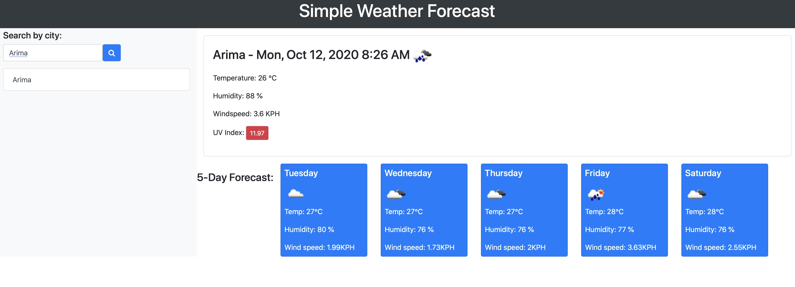

# Simple Weather Dashboard

## Powered by the openweather api

**The process follows these steps:**
1. Users can search for the weather for a city of their choice
2. Once the search button is clicked data on current weather for selected location is displayed
    *Temperature
    *Humidity
    *Windspeed
    *UV Index
3. A 5-Day forecast is also displayed
4. Each city that a user searches is added to a on screen history section for quick access to revisit
5. The UV Index is given a color of safe (Green), warning (Yellow), and danger (RED) based on its value

Application URL: https://sterlynkong.github.io/weather-dashboard/

Application image: 